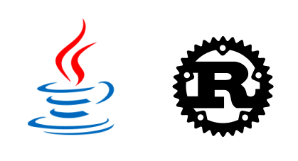

# OdinMS In Rust
  
The OdinMS emulator translated to [Rust](https://doc.rust-lang.org/book/title-page.html).

Rust is a multi-paradigm low-level systems programming language.  
It is compiled into machine code, much like C++.

Unlike C++, however, Rust
- is not strictly OOP, but has OOP-like features
- enforces mutability, locks and ownership to ensure multithreading safety
- separates null and non-null types to avoid mistreatment of pointers
- checks for ownership access to manage memory without resorting to garbage collection
- assists with library management using modules, crates and a package manager

Translation ratio: 
1 Java file => 1 Rust file

Translation progress:  
Java: 251  
Rust: 1  


Linux command to check number of Java files:  
```
ls -lR * | grep --count \.java$
```

Linux command to check number of Rust files:  
```
ls -lR * | grep --count \.rs$
```
